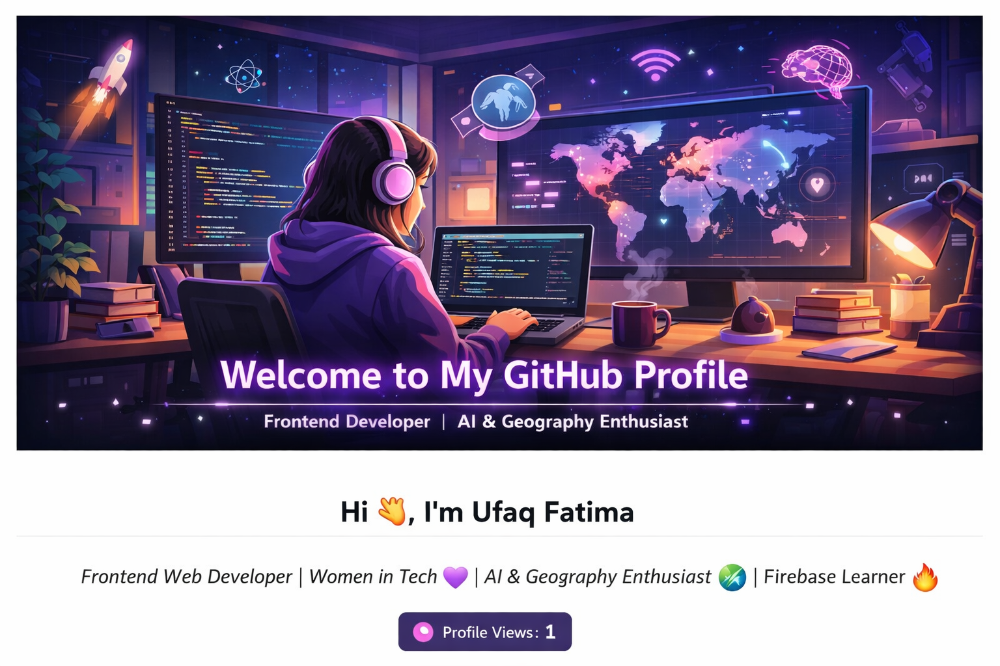

# Hi 👋, I'm Ufaq Fatima  

  

  

---

## 🌸 About Me

👩‍💻 Frontend Web Developer  
🎓 Student at **Saylani Mass IT Hub**  
🤖 AI Hackathon Participant (AI FemHack)  
🌍 Geography + Digital Learning Lover  
🔥 Exploring Firebase & JavaScript  
💜 Passionate about Women in Tech  

---

## 🌍 Tech Stack & Tools

### 💻 Frontend
- HTML5  
- CSS3  
- Bootstrap  
- JavaScript  

### 🔥 Backend & Tools
- Firebase  
- Git  
- GitHub  

### 🎨 Design & Skills
- Responsive Web Design  
- UI/UX Basics  
- Clean & Structured Code  

---

## 🚀 Projects

🌍 **Geographical Insights**  
Interactive geography learning website with map-based visuals  

🤖 **AI FemHack Hackathon Project**  
AI-based solution built during a women-focused hackathon  

🏫 **Saylani Mass IT Hub Portal**  
Multi-feature portal including:
- Lost & Found  
- Complaints System  
- Student Utilities  

---

## 📊 GitHub Stats

  

  

  

---

## 🌐 Connect With Me

💼 LinkedIn:  
📧 Email: u.capricorn19@gmail.com  

---

## 🌟 Fun Fact

🌍 I mix Geography + Technology + Creativity to build meaningful digital experiences ✨  

---

⭐ If you like my work, don’t forget to star my reposito

