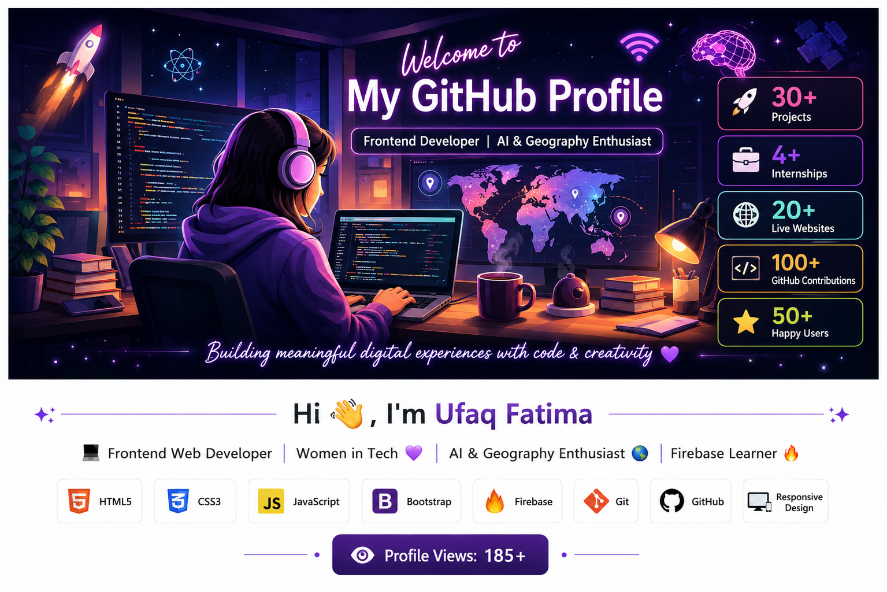

<p align="center">
  
</p>

<h1 align="center">Hi there, I'm Syeda Ufaq Fatima 👋</h1>

<h3 align="center">
💻 Frontend Web Developer | 🎨 UI Enthusiast | 🌍 Geography Graduate | 📍 Pakistan
</h3>

<p align="center">
  <a href="https://github.com/UfaqFatima786">
    
  </a>
  <a href="https://github.com/UfaqFatima786?tab=repositories">
    
  </a>
</p>

---

## 👩‍💻 About Me

I'm a passionate **Frontend Web Developer** who enjoys creating responsive, modern, interactive, and user-friendly websites.

I love turning ideas into functional web experiences using **HTML, CSS, JavaScript, Bootstrap, APIs, and Supabase**. Alongside my development journey, I have a background in **Geography** and I'm currently pursuing an **MBA**.

I'm continuously improving my skills through internships, hackathons, real-world projects, and self-learning.

* 💻 Frontend Web Developer
* 🎓 Geography Graduate
* 🎓 Currently pursuing MBA
* 🚀 Hackathon Participant
* 💜 Women in Tech Enthusiast
* 🌱 Currently learning React.js
* 🔥 Interested in modern web technologies
* 🗺️ GIS & Mapping Enthusiast
* 💡 Love building practical web projects

---

## 🛠️ Tech Stack

### 💻 Frontend Development

<p>

</p>

* HTML5
* CSS3
* JavaScript (ES6+)
* Bootstrap
* React.js
* Responsive Web Design
* DOM Manipulation
* API Integration

### 🗄️ Backend & Database

<p>

</p>

* Supabase
* Supabase Authentication
* Supabase CRUD Operations
* Firebase
* REST APIs

### 🛠️ Development Tools

<p>

</p>

* Git
* GitHub
* VS Code
* Netlify
* Canva

### 🌍 Other Skills

* Python
* GIS Mapping
* ArcGIS
* QGIS
* PostGIS
* GDAL
* MS Office
* UI/UX Basics

---

# 🚀 Featured Projects

Here are some of the projects I've built while learning and working on real-world development tasks.

### 🌍 Geographical Insights

An interactive educational website focused on **geography, maps, climate, landscapes, countries, and geographical information**.

**Tech:** HTML, CSS, JavaScript

---

### 🏫 CampusConnect

A student-focused campus platform designed to bring together **posts, events, polls, lost & found, study partners, notifications, and announcements**.

**Tech:** HTML, CSS, JavaScript, Supabase

**Features:**

* Student dashboard
* Posts & interactions
* Events
* Polls & voting
* Lost & Found
* Study Partners
* Notifications
* Admin Dashboard
* Announcements
* Supabase Authentication

---

### 🤖 AI-FemHack

A responsive AI-focused project created for the **AI FemHack Hackathon**.

**Tech:** HTML, CSS, JavaScript, Bootstrap

**Focus:** AI, women in technology, responsive UI and hackathon development.

---

### 🍕 Pizza Mania

A modern responsive pizza ordering website with an attractive interface and interactive elements.

**Tech:** HTML, CSS, Bootstrap, JavaScript

---

### 🌸 Floral Blossom

A responsive floral-themed website featuring beautiful layouts and modern styling.

**Tech:** HTML, CSS, JavaScript

---

### ✨ Glow Heaven

A modern beauty/glow-themed website built with responsive layouts, CSS animations, and Bootstrap.

**Tech:** HTML, CSS, Bootstrap, JavaScript

---

### 🧁 Bakers & Sweets

A responsive bakery website featuring cakes, sweets, bakery products, and Nimco collections.

**Tech:** HTML, CSS, Bootstrap, JavaScript

---

### 🎂 Miss Umra Birthday

A creative birthday website developed with animations and interactive visual elements.

**Tech:** HTML, CSS, JavaScript, Bootstrap, GSAP

---

### 🌦️ Weather App

A real-time weather application that fetches weather information using a weather API.

**Tech:** HTML, CSS, JavaScript, Weather API

---

### 🧮 Calculator App

A responsive calculator application created as part of my CodeAlpha internship.

**Tech:** HTML, CSS, JavaScript, Bootstrap

---

### 🖼️ Image Gallery App

An interactive image gallery project with responsive design and user-friendly navigation.

**Tech:** HTML, CSS, JavaScript

---

### 📝 Quiz App

An interactive quiz application featuring questions, score tracking, and timer functionality.

**Tech:** HTML, CSS, JavaScript, Bootstrap

---

### 📚 Student Admission Portal

An interactive student admission form developed during my internship.

**Tech:** HTML, CSS, JavaScript, Firebase

---

## 💼 Internship Experience

* 💻 Frontend Development Intern
* 💼 CodeAlpha Internship
* 💼 SyntecxHub Internship
* 💼 Codveda Technologies Internship
* 💼 CrixSoft Internship
* 💼 Decode Labs Internship Projects

Through these experiences, I worked on practical frontend projects, responsive websites, JavaScript applications, forms, APIs, and modern web interfaces.

---

## 🏆 Hackathons & Challenges

### 🤖 AI FemHack 2026

Participated in an AI-based women-focused hackathon and developed a responsive web project.

### 🚀 Web Development Projects

Regularly participate in internship tasks, coding challenges, frontend projects, and practical development assignments.

---

## 📚 Currently Learning

```text
JavaScript        ███████████████████░
React.js          ████████████░░░░░░░
API Integration   ███████████████░░░░
Supabase          ███████████████░░░░
Modern UI/UX      ███████████████░░░░
```

Currently focusing on:

* ⚡ Advanced JavaScript
* ⚛️ React.js
* 🔌 API Integration
* 🗄️ Supabase
* 🎨 Modern UI/UX
* 📱 Responsive Web Development
* 🚀 Full-Stack Development

---

# 📊 GitHub Analytics

<p align="center">
  

  
</p>

---

# 🔥 GitHub Streak

<p align="center">
  
</p>

---

# 🐍 Contribution Graph

<p align="center">
  
</p>

---

# 📈 GitHub Activity

<p align="center">
  
</p>

---

# 🌐 Connect With Me

<p align="center">

<a href="mailto:u.capricorn19@gmail.com">

</a>

<a href="https://github.com/UfaqFatima786">

</a>

<a href="https://www.linkedin.com/in/syeda-ufaq-fatima-237062385/">

</a>

</p>

---

<h3 align="center">💜 Thanks for visiting my profile!</h3>

<p align="center">
⭐ Feel free to explore my repositories and projects.
</p>

